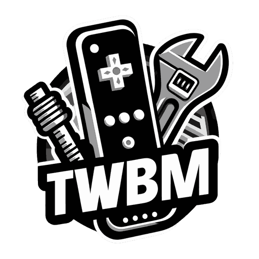
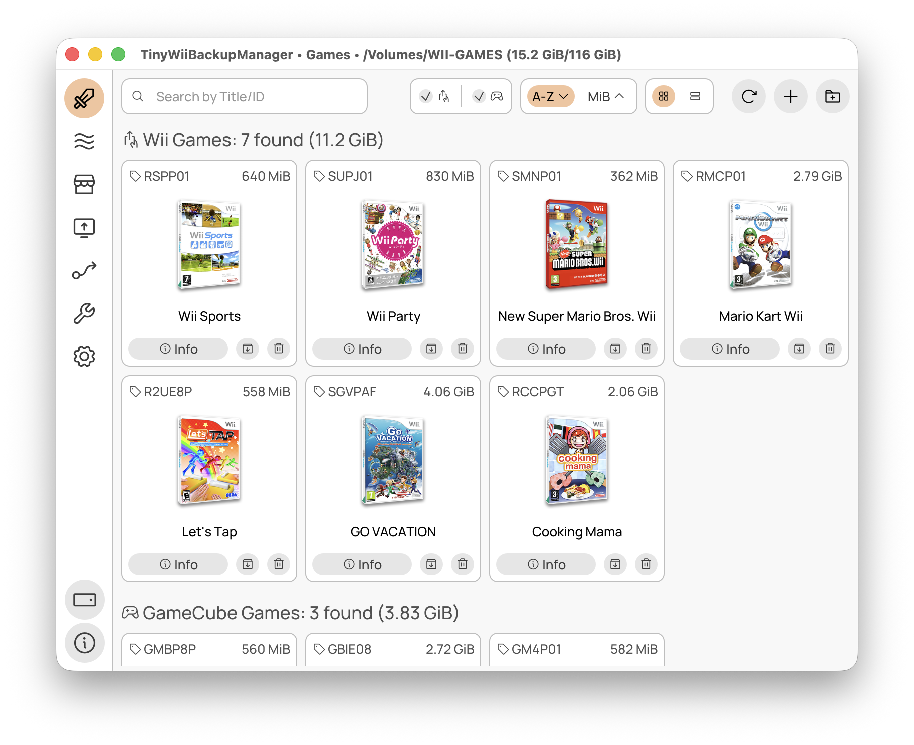

### `TinyWiiBackupManager` ⭐ A tiny game backup and homebrew app manager for the Wii

 

> [!CAUTION]
> TinyWiiBackupManager is intended strictly for legal homebrew use and is not affiliated with or endorsed by Nintendo.
> Use of TinyWiiBackupManager for pirated or unauthorized copies of games is strictly prohibited.

## ✨ Features

- **Lightweight & Fast**: Native app, -O3, LTO, x86_64-v3 optimized builds
- **Cross-Platform**: Windows 7+, macOS 10.12+, Linux | x86, x86_64, arm64

#### 🎮 Game Management

- **Games view**: Manage your Wii and GameCube games
- **Format Support**: .iso, .rvz and major formats thanks to [NOD](https://github.com/encounter/nod)
- **Automatic Splitting**: .wbfs file splitting when needed
- **Partition Stripping**: Remove the update partition to save space
- **Game Archiving**: Archive games using RVZ+zstd-19
- **Integrity Checks**: Verify game data for corruption
- **GameTDB**: Fetch covers and `wiitdb.xml` from GameTDB
- **TxtCodes**: Download cheat codes from geckocodes.org (web archive), codes.rc24.xyz and gamehacking.org

#### 🛠️ Wii Homebrew Management

- **Apps view**: Manage Wii homebrew applications
- **OSC view**: Download apps from the Open Shop Channel
- **Wiiload**: Send apps directly to Wii via network

## ⬇️ Downloads

<table>
  <tr>
    <td>
        &nbsp;&nbsp;&nbsp;&nbsp;&nbsp;&nbsp;&nbsp;&nbsp;&nbsp;&nbsp;&nbsp;&nbsp;&nbsp;&nbsp;&nbsp;&nbsp;
         
        
         
        Windows 10+
         
        &nbsp;&nbsp;&nbsp;&nbsp;&nbsp;&nbsp;&nbsp;&nbsp;&nbsp;&nbsp;&nbsp;&nbsp;&nbsp;&nbsp;&nbsp;&nbsp;
    </td>
    <td>
        &rarr;&nbsp;<a href="https://github.com/mq1/TinyWiiBackupManager/releases/latest">Download Standalone/Installer</a>&nbsp;&larr;
          
        ℹ️ If you don't know which asset to download, <kbd>TinyWiiBackupManager-vX.X.X-windows-x86_64.zip</kbd> should work for most users
          
        ⚡️ If you have a recent CPU (see <a href="https://en.wikipedia.org/wiki/X86-64#Microarchitecture_levels">here</a>), you can get the slightly faster <kbd>TinyWiiBackupManager-vX.X.X-windows-x86_64-v3.zip</kbd>
          
        🔋 If you have a ARM-based PC (see <a href="https://en.wikipedia.org/wiki/List_of_Qualcomm_Snapdragon_systems_on_chips#Snapdragon_X_series">here</a>), you can get the faster, efficient and fully native <kbd>TinyWiiBackupManager-vX.X.X-windows-arm64.zip</kbd>
          
        🍨 A scoop package is also available:
         
        <code>scoop bucket add TinyWiiBackupManager https://github.com/mq1/TinyWiiBackupManager</code>
         
        <code>scoop install TinyWiiBackupManager</code>
          
        📦 A winget package is also available:
         
        <code>winget install -e --id mq1.TinyWiiBackupManager</code>
    </td>
  </tr>
</table>

<table>
  <tr>
    <td>
        &nbsp;&nbsp;&nbsp;&nbsp;&nbsp;&nbsp;&nbsp;&nbsp;&nbsp;&nbsp;&nbsp;&nbsp;&nbsp;&nbsp;&nbsp;&nbsp;
         
        
         
        Linux
         
        &nbsp;&nbsp;&nbsp;&nbsp;&nbsp;&nbsp;&nbsp;&nbsp;&nbsp;&nbsp;&nbsp;&nbsp;&nbsp;&nbsp;&nbsp;&nbsp;
    </td>
    <td>
        &rarr;&nbsp;<a href="https://github.com/mq1/TinyWiiBackupManager/releases/latest">Download AppImage/Tarball</a>&nbsp;&larr;
         
        &rarr;&nbsp;<a href="https://flathub.org/apps/it.mq1.TinyWiiBackupManager">Download Flatpak (Flathub)</a>&nbsp;&larr;
          
        ℹ️ If you don't know which asset to download, <kbd>TinyWiiBackupManager-vX.X.X-linux-x86_64.AppImage</kbd> should work for most users
          
        ⚡️ If you have a recent CPU (see <a href="https://en.wikipedia.org/wiki/X86-64#Microarchitecture_levels">here</a>), you can get the slightly faster <kbd>TinyWiiBackupManager-vX.X.X-linux-x86_64-v3.AppImage</kbd>
          
        🔋 If you have a ARM-based PC (see <a href="https://en.wikipedia.org/wiki/List_of_Qualcomm_Snapdragon_systems_on_chips#Snapdragon_X_series">here</a>), you can get the faster, efficient and fully native <kbd>TinyWiiBackupManager-vX.X.X-linux-arm64.AppImage</kbd>
    </td>
  </tr>
</table>

<table>
  <tr>
    <td>
        &nbsp;&nbsp;&nbsp;&nbsp;&nbsp;&nbsp;&nbsp;&nbsp;&nbsp;&nbsp;&nbsp;&nbsp;&nbsp;&nbsp;&nbsp;&nbsp;
         
        
         
        macOS
         
        &nbsp;&nbsp;&nbsp;&nbsp;&nbsp;&nbsp;&nbsp;&nbsp;&nbsp;&nbsp;&nbsp;&nbsp;&nbsp;&nbsp;&nbsp;&nbsp;
    </td>
    <td>
        &rarr;&nbsp;<a href="https://github.com/mq1/TinyWiiBackupManager/releases/latest">Download DMG/ZIP</a>&nbsp;&larr;
          
        ℹ️ If you don't know which asset to download, <kbd>TinyWiiBackupManager-vX.X.X-macos-arm64.dmg</kbd> should work for most users
          
      🖥️ If you have a Intel-based Mac, you need to get <kbd>TinyWiiBackupManager-vX.X.X-macos-x86-64.dmg</kbd>
          
        ⚠️ The app is not notarized, you must allow it manually after installing by running this command in Terminal:
        <code>xattr -rd com.apple.quarantine /Applications/TinyWiiBackupManager.app</code>
    </td>
  </tr>
</table>

<table>
  <tr>
    <td>
        &nbsp;&nbsp;&nbsp;&nbsp;&nbsp;&nbsp;&nbsp;&nbsp;&nbsp;&nbsp;&nbsp;&nbsp;&nbsp;&nbsp;&nbsp;&nbsp;
         
        &nbsp;&nbsp;
         
        Windows 7-8-8.1
         
        &nbsp;&nbsp;&nbsp;&nbsp;&nbsp;&nbsp;&nbsp;&nbsp;&nbsp;&nbsp;&nbsp;&nbsp;&nbsp;&nbsp;&nbsp;&nbsp;
    </td>
    <td>
        &rarr;&nbsp;<a href="https://github.com/mq1/TinyWiiBackupManager/releases/latest">Download Standalone/Installer</a>&nbsp;&larr;
          
        ℹ️ If you don't know which asset to download, <kbd>TinyWiiBackupManager-vX.X.X-windows7-x86.zip</kbd> should work for most users
          
        ⚠️ This package is untested and may not work
          
    </td>
  </tr>
</table>

## 📄 Additional Info

For useful tips, check out the [Wiki](https://github.com/mq1/TinyWiiBackupManager/wiki)

 
 

 Made with 🤍🩷🩵🤎🖤❤️🧡💛💚💙💜 for the Wii homebrew community 

