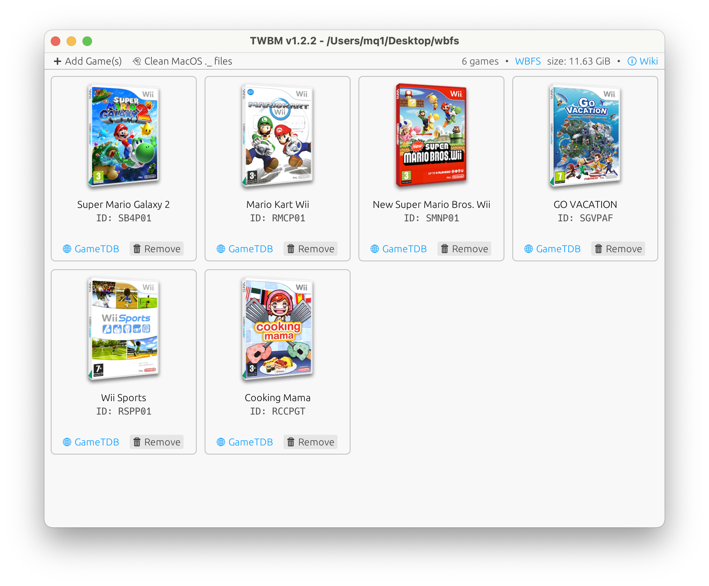

    
    <h1 align="center">TinyWiiBackupManager</h1>
    
A dead simple Wii backup manager

    
‼️ Make sure to only play your legally obtained backups ‼️

    
🏴‍☠️ This project does NOT support piracy 🏴‍☠️

    

### 💽 Supported input formats (thanks to [NOD](https://github.com/encounter/nod))

<kbd>ISO (GCM)</kbd>
<kbd>WIA / RVZ</kbd>
<kbd>WBFS (+ NKit 2 lossless)</kbd>
<kbd>CISO (+ NKit 2 lossless)</kbd>
<kbd>NFS (Wii U VC, read-only)</kbd>
<kbd>GCZ</kbd>
<kbd>TGC</kbd>

## ⬇️ Downloading

Just grab the [latest release](https://github.com/mq1/TinyWiiBackupManager/releases/latest) for your platform

### 🍎 MacOS

⚠️ The app is NOT notarized, you need to allow it:\
🏃‍➡️ Run `sudo xattr -rd com.apple.quarantine /Applications/TinyWiiBackupManager.app` in the terminal

## 📄 Additional info in the [wiki](https://github.com/mq1/TinyWiiBackupManager/wiki)
