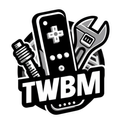
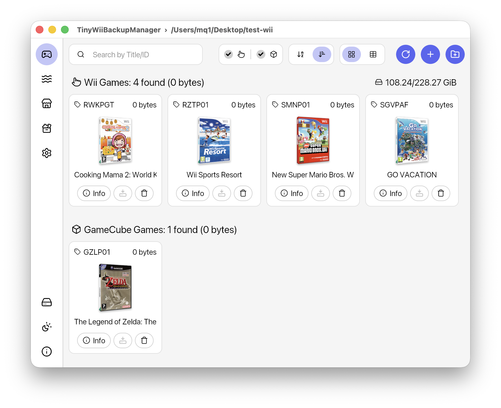

  

<h1 align="center">TinyWiiBackupManager</h1>

  ‼️ <strong>Only use with legally obtained backups</strong> ‼️ 
  🏴‍☠️ <strong>This project does NOT support piracy</strong> 🏴‍☠️

  

## ✨ Features

- **Lightweight & Fast** — No Electron!!
- **Clean Interface** — Simple design with light and dark themes
- **Cross-Platform** — Windows 10+, macOS 11+, Linux (AMD64, ARM64)

### 🎮 **Game Management**

- **Grid View** — Browse games with cover art display
- **Format Support** — .iso, .rvz and major formats via [NOD](https://github.com/encounter/nod)
- **Automatic Splitting** — .wbfs file splitting when needed
- **Partition Stripping** — Remove unused partitions (experimental)
- **Game Archiving** — Archive games using RVZ+zstd-19
- **Integrity Checks** — Verify game data for corruption
- **GameTDB** — Fetch covers and `wiitdb.xml` from GameTDB

### 🛠️ **Wii Homebrew Management**

- **Apps View** — Manage Wii homebrew applications
- **ZIP Import** — Add apps from `.zip` archives
- **OSCWii** — Download apps from the Open Shop Channel
- **Wiiload Transfer** — Send apps directly to Wii via network

## ⬇️ Download

| Platform | Get the latest version from the **[Releases page](https://github.com/mq1/TinyWiiBackupManager/releases/latest)** |
|----------|------------------|
| 🐧 **Linux** | ⬇️ Download the `.AppImage` 📦 Or look for TinyWiiBackupManager on **Flathub** |
| 🪟 **Windows** | ⬇️ Download the `setup.exe` (installer) or the `win-portable.zip` (portable) 📦 Or run `winget install mq1.TinyWiiBackupManager` 🐌 On Windows Legacy (32bit, win7-8-8.1): `win7.zip` |
| 🍏 **macOS** | ⬇️ Download the `.dmg` ⚠️ The app is not notarized ⚠️ You must allow it manually after installing by running this command in Terminal: ➡️ `xattr -rd com.apple.quarantine /Applications/TinyWiiBackupManager.app` |

## 📄 Additional Info

For useful tips, check out the [Wiki](https://github.com/mq1/TinyWiiBackupManager/wiki)

 
 

 Made with 🤍🩷🩵🤎🖤❤️🧡💛💚💙💜 for the Wii homebrew community 

