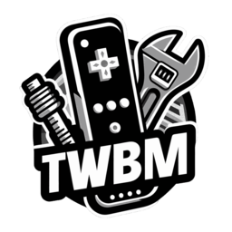
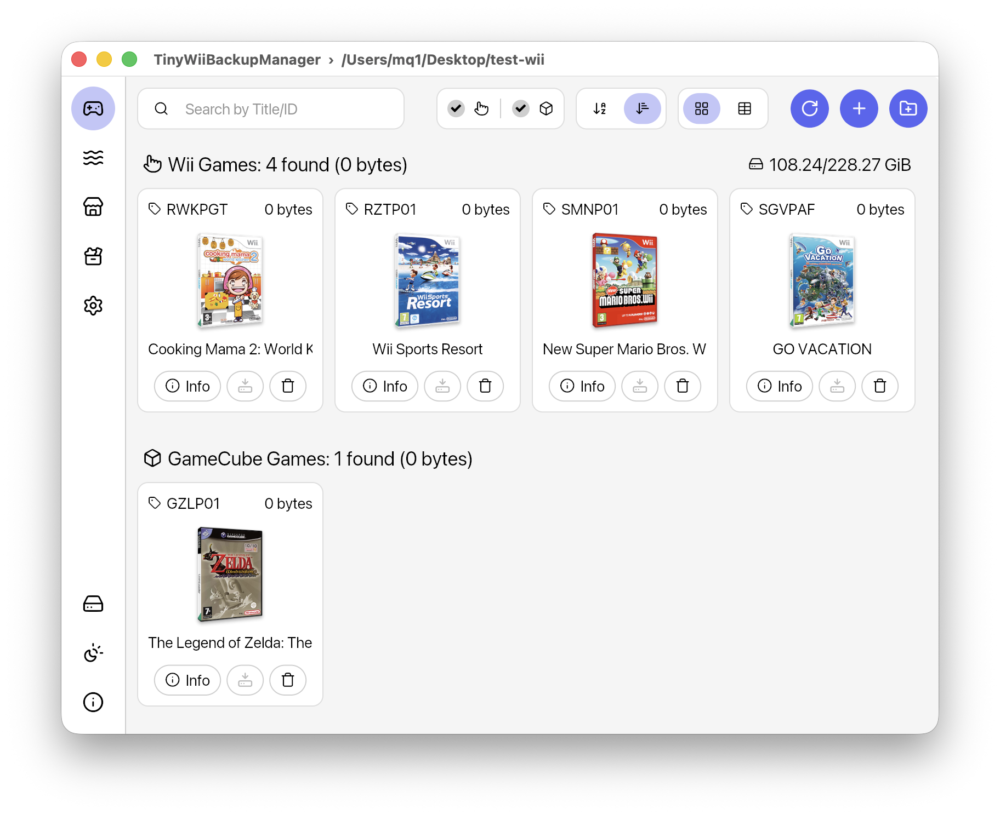

### `TinyWiiBackupManager` :star: A tiny game backup and homebrew app manager for the Wii

 

> [!CAUTION]
> TinyWiiBackupManager is intended strictly for legal homebrew use and is not affiliated with or endorsed by Nintendo.
> Use of TinyWiiBackupManager for pirated or unauthorized copies of games is strictly prohibited.

## :sparkles: Features

- **Lightweight & Fast**: Native app written in Rust and Slint, no Electron!
- **Cross-Platform**:
  - :window: Windows XP+ | x86 (32-bit), x64 (64-bit), arm64 (Qualcomm Snapdragon etc.)
  - :apple: macOS 10.13+ | x86_64 (Intel), arm64 (Apple Silicon/M1+)
  - :penguin: Linux | i686 (32-bit), x86_64 (64-bit), armhf/arm64 (Raspberry PIs etc.)

#### :video_game: Game Management

- **Games view**: Manage your Wii and GameCube games
- **Format Support**: .iso, .rvz and major formats thanks to [NOD](https://github.com/encounter/nod)
- **Automatic Splitting**: .wbfs file splitting when needed
- **Partition Stripping**: Remove the update partition to save space
- **Game Archiving**: Archive games using RVZ+zstd-19
- **Integrity Checks**: Verify game data for corruption
- **GameTDB**: Fetch covers and `wiitdb.xml` from GameTDB
- **TxtCodes**: Download cheat codes from geckocodes.org (web archive), codes.rc24.xyz and gamehacking.org

#### :toolbox: Wii Homebrew Management

- **Apps view**: Manage Wii homebrew applications
- **OSC view**: Download apps from the Open Shop Channel
- **Wiiload**: Send apps directly to Wii via network

 

## :arrow_down: Downloads

<table>
  <tr>
    <td width="9999px"><strong>:window: Windows</strong></td>
  </tr>
  <tr>
    <td>
      :arrow_right: <a href="https://github.com/mq1/TinyWiiBackupManager/releases/latest">Download standalone binary (recommended for most users)</a>
       
      :arrow_right: <a href="https://github.com/mq1/TinyWiiBackupManagerInstaller/releases/latest/download/TinyWiiBackupManagerInstaller.exe">Download installer</a> (automatic arch detection)
       
       
      :warning: Windows < 10 users should download the <code>windows-legacy</code> standalone binary.
       
       
      :ice_cream: scoop:
       
      <code>scoop bucket add TinyWiiBackupManager https://github.com/mq1/TinyWiiBackupManager</code>
       
      <code>scoop install TinyWiiBackupManager</code>
       
       
      :package: winget:
       
      <code>winget install -e --id mq1.TinyWiiBackupManager</code>
    </td>
  </tr>
</table>

<table>
  <tr>
    <td width="9999px"><strong>:apple: macOS</strong></td>
  </tr>
  <tr>
    <td>
      :arrow_right: <a href="https://github.com/mq1/TinyWiiBackupManager/releases/latest">Download latest DMG</a> (Universal Binary recommended for most users)
       
       
      :warning: The app is not notarized, you must allow it manually after installing by running this command in Terminal:
       
      <code>xattr -rd com.apple.quarantine /Applications/TinyWiiBackupManager.app</code>
    </td>
  </tr>
</table>

<table>
  <tr>
    <td width="9999px"><strong>:penguin: Linux</strong></td>
  </tr>
  <tr>
    <td>
      :arrow_right: <a href="https://flathub.org/apps/it.mq1.TinyWiiBackupManager">Download on Flathub</a> (recommended for most users)
       
      :arrow_right: <a href="https://github.com/mq1/TinyWiiBackupManager/releases/latest">Download latest AppImage</a>
    </td>
  </tr>
</table>

 

## :page_facing_up: Additional Info

For useful tips, check out the [Wiki](https://github.com/mq1/TinyWiiBackupManager/wiki)

 
 

 Made with :white_heart::pink_heart::light_blue_heart::brown_heart::black_heart::heart::orange_heart::yellow_heart::green_heart::blue_heart::purple_heart: for the Wii homebrew community 

