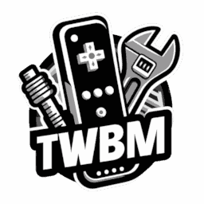

### `TinyWiiBackupManager` (A tiny game backup and homebrew app manager for the Wii)

‼️ TinyWiiBackupManager is intended strictly for legal homebrew use and is not affiliated with or endorsed by
Nintendo. ‼️ Use of TinyWiiBackupManager for pirated or unauthorized copies of games is strictly prohibited.

  

## ✨ Features

- **Lightweight & Fast**: Native DX12/Metal/OpenGL rendering, -O3, LTO, x86_64-v3 optimized builds
- **Cross-Platform**: Windows 7+ (x86, x64, arm64), macOS 10.12+ (x64, arm64), Linux (x86, x64, arm64)

#### 🎮 Game Management

- **Games view**: Manage your Wii and GameCube games
- **Format Support**: .iso, .rvz and major formats thanks to [NOD](https://github.com/encounter/nod)
- **Automatic Splitting**: .wbfs file splitting when needed
- **Partition Stripping**: Remove the update partition to save space
- **Game Archiving**: Archive games using RVZ+zstd-19
- **Integrity Checks**: Verify game data for corruption
- **GameTDB**: Fetch covers and `wiitdb.xml` from GameTDB
- **TxtCodes**: Download cheat codes from geckocodes.org (web archive), codes.rc24.xyz and gamehacking.org

#### 🛠️ Wii Homebrew Management

- **Apps view**: Manage Wii homebrew applications
- **OSC view**: Download apps from the Open Shop Channel
- **Wiiload**: Send apps directly to Wii via network

## ⬇️ Downloads

<table>
  <tr>
    <td>
        &nbsp;&nbsp;&nbsp;&nbsp;&nbsp;&nbsp;&nbsp;&nbsp;&nbsp;&nbsp;&nbsp;&nbsp;&nbsp;&nbsp;&nbsp;&nbsp;&nbsp;&nbsp;&nbsp;&nbsp;
         
        
         
        Windows
         
        &nbsp;&nbsp;&nbsp;&nbsp;&nbsp;&nbsp;&nbsp;&nbsp;&nbsp;&nbsp;&nbsp;&nbsp;&nbsp;&nbsp;&nbsp;&nbsp;&nbsp;&nbsp;&nbsp;&nbsp;
    </td>
    <td>
        
          
        ℹ️ If you don't know which asset to download, <kbd>TinyWiiBackupManager-vX.X.X-windows-x86_64.zip</kbd> should work for most users
          
        ⚡️ If you have a recent CPU (see <a href="https://en.wikipedia.org/wiki/X86-64#Microarchitecture_levels">here</a>), you can get the slightly faster <kbd>TinyWiiBackupManager-vX.X.X-windows-x86_64-v3.zip</kbd>
    </td>
  </tr>
</table>

<table>
  <tr>
    <td>
        &nbsp;&nbsp;&nbsp;&nbsp;&nbsp;&nbsp;&nbsp;&nbsp;&nbsp;&nbsp;&nbsp;&nbsp;&nbsp;&nbsp;&nbsp;&nbsp;&nbsp;&nbsp;&nbsp;&nbsp;
         
        
         
        Linux
         
        &nbsp;&nbsp;&nbsp;&nbsp;&nbsp;&nbsp;&nbsp;&nbsp;&nbsp;&nbsp;&nbsp;&nbsp;&nbsp;&nbsp;&nbsp;&nbsp;&nbsp;&nbsp;&nbsp;&nbsp;
    </td>
    <td>
         
          
        ℹ️ If you don't know which asset to download, <kbd>TinyWiiBackupManager-vX.X.X-linux-x86_64.AppImage</kbd> should work for most users
          
        ⚡️ If you have a recent CPU (see <a href="https://en.wikipedia.org/wiki/X86-64#Microarchitecture_levels">here</a>), you can get the slightly faster <kbd>TinyWiiBackupManager-vX.X.X-linux-x86_64-v3.AppImage</kbd>
    </td>
  </tr>
</table>

<table>
  <tr>
    <td>
        &nbsp;&nbsp;&nbsp;&nbsp;&nbsp;&nbsp;&nbsp;&nbsp;&nbsp;&nbsp;&nbsp;&nbsp;&nbsp;&nbsp;&nbsp;&nbsp;
         
        
         
        macOS
         
        &nbsp;&nbsp;&nbsp;&nbsp;&nbsp;&nbsp;&nbsp;&nbsp;&nbsp;&nbsp;&nbsp;&nbsp;&nbsp;&nbsp;&nbsp;&nbsp;&nbsp;&nbsp;&nbsp;&nbsp;
    </td>
    <td>
        
          
        ℹ️ If you don't know which asset to download, <kbd>TinyWiiBackupManager-vX.X.X-macos-arm64.dmg</kbd> should work for most users
          
        ⚠️ The app is not notarized, you must allow it manually after installing by running this command in Terminal:
         
        <code>xattr -rd com.apple.quarantine /Applications/TinyWiiBackupManager.app</code>
    </td>
  </tr>
</table>

<table>
  <tr>
    <td>
        &nbsp;&nbsp;&nbsp;&nbsp;&nbsp;&nbsp;&nbsp;&nbsp;&nbsp;&nbsp;&nbsp;&nbsp;&nbsp;&nbsp;&nbsp;&nbsp;&nbsp;&nbsp;&nbsp;&nbsp;
         
        &nbsp;&nbsp;&nbsp;
         
        Windows 7
         
        &nbsp;&nbsp;&nbsp;&nbsp;&nbsp;&nbsp;&nbsp;&nbsp;&nbsp;&nbsp;&nbsp;&nbsp;&nbsp;&nbsp;&nbsp;&nbsp;&nbsp;&nbsp;&nbsp;&nbsp;
    </td>
    <td>
        
          
        ℹ️ If you don't know which asset to download, <kbd>TinyWiiBackupManager-vX.X.X-windows7-x86.zip</kbd> should work for most users
          
        ⚠️ This package is untested and may not work
    </td>
  </tr>
</table>

## 📄 Additional Info

For useful tips, check out the [Wiki](https://github.com/mq1/TinyWiiBackupManager/wiki)

 
 

 Made with 🤍🩷🩵🤎🖤❤️🧡💛💚💙💜 for the Wii homebrew community 

